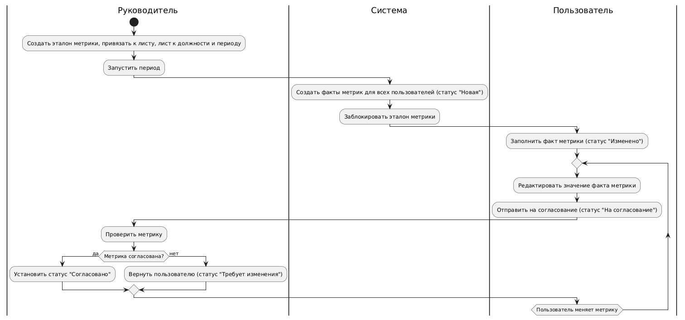
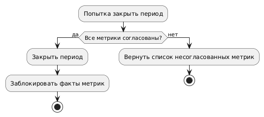

# 01 Business Requirements.Md

## 1. Бизнес-потребность
Уменьшить трудозатраты на обеспечение эффективной мотивации сотрудников.

## 2. Бизнес-цель
Автоматизировать учёт достижений сотрудников, их подтверждение и распределение фонда стимулирующих выплат на основе заранее заданных весов KPI.

## 3. Стейкхолдеры
### 3.1. Сотрудник
Добавляет свои достижения, отслеживает статусы, получает информацию о размере стимулирующей выплаты.
### 3.2. Руководитель
То же, что у сотрудника, + проверяет и подтверждает достижения своих подчинённых. 
### 3.3. Заместитель директора
То же, что у руководителя, + управляет списком метрик, отслеживает готовность подразделений.
### 3.4. Директор (администратор)
То же, что у заместителя директора, + утверждает период, фиксирует выплаты, вносит ручные корректировки.

## 4. Целевые эффекты
- Сокращение ручной работы по обработке оценочных листов не менее чем на 50%;
- Повышение прозрачности и доверия к системе премирования;
- Возможность формирования корректной и гибкой мотивационной политики;
- Поддержка масштабируемости на разные типы учреждений.

## 5. Основные бизнес-процессы
BP-01 - Управление пользователями

- Создание, редактирование, привязка руководителей, удаление, блокировка

BP-02 - Подготовка периода

- Инициация нового отчетного периода;
- Добавление обязательных KPI-метрик;
- Добавление опциональных достижений;
- Привязка метрик и достижений к должности (формирование оценочных листов);

BP-03 - Запуск периода

- Запуск периода (фиксация весов метрик, достижений и оценочных листов);
- Заполнение метрик сотрудником;
- Добавление достижений сотрудником;
- Мониторинг заполнения оценочных листов (для руководителя);
- Подтверждение достижений (для руководителя);

BP-04 

- Завершение периода (фиксация заполненных метрик и достижений);
- Расчёт премий;
- Просмотр и экспорт отчетности.

## 6. Бизнес-правила
- Один премиальный фонд на период;
- Итоговое общее количество баллов и размер премий другим сотрудникам не отображаются;
- Вес метрик фиксируется до запуска периода и не может быть изменён задним числом;
- Руководитель у сотрудника только один, но просмотреть/завалидировать его метрики может вся вертикаль до директора;
- Добавление достижения возможно только при наличии прикреплённого подтверждающего документа (скан до 10 МБ);
- Руководитель может подтвердить достижения только тех сотрудников, которые ему подчинены;
- Добавленное достижение проходит статусный переход: новое → на валидации → подтверждено или отклонено;
- Метрика действует в рамках периода и может быть привязана к определённой должности;
- Все изменения логируются и отображаются в разделе истории;
- Достижения можно вносить только до завершения периода;
- Завершение периода блокирует все изменения и инициирует расчёт.
- У сотрудника может быть альтернативный руководитель с соответствующей вертикалью (например, проектный или временный)
- После подтверждения достижения руководителем, оно фиксируется в статусе "Подтверждено"
- После подтверждения достижения руководителем пользователь может внести изменение, но тогда статус сбросится до "На согласование"

## 8. Критерии успеха
- < 10% сотрудников обращаются за разъяснениями по итогам;
- Все действия отражаются в журнале изменений;
- Среднее время заполнения — не более 5 минут на одного сотрудника;
- Ведомости по премиям автоматически формируются и соответствуют бизнес-логике;
- Время заполнения оценочного листа сокращено на 50% относительно ручного подхода;
- Время фасилитации оценочного листа сокращено на 65% относительно ручного подхода;
- Число попыток фасилитации снижено на 50%;
- Время расчета премиальных (конец отчетного периода) сокращено на 80% относительно ручного подхода.

## 9. Ограничения внедрения
- Возможность развёртывания в инфраструктуре учреждения (on-premise);
- Поддержка до 1000 сотрудников и 500 одновременных пользователей;
- Интерфейс должен быть интуитивно понятен без дополнительного обучения;
- Хранение документов по достижениям должно быть надёжным, с защитой доступа;
- Прошедшие периоды архивируются и выгружаются в виде таблицы XLSX, где каждый сотрудник на отдельном листе.