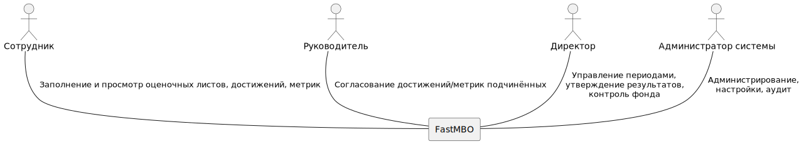

# Проект: FastKPI

## Цели
Минимизация ручного труда в бизнес-процессах стимулирования сотрудников:

## Задачи:
- Управление пользователями
- Постановка целей на период (метрик)
- Утверждение веса достижений
- Утверждение оценочных листов должностей
- Распределение оценочных листов по сотрудникам
- Заполнение метрик пользователями
- Добавление достижений пользователями
- Расчет размера премиальных выплат для сотрудников, исходя из результатов работы и достижений

## Контекст
Система предназначена для учреждений, в которых мотивация осуществляется через фиксированный премиальный фонд, распределяемый пропорционально результатам работы и достижениям сотрудников.

### Стейкхолдеры:
Сотрудники: все работники учреждения, у кого должен быть оценочный лист, метрики и достижения которого должны отслеживаться системой. Может заполнять метрики и добавлять достижения.

Руководители: те сотрудники, которые указаны у других сотрудников как их руководитель. Непосредственно, кто валидирует метрики и достижения подчиненных.

Заместители директора: те, кому делегированы права на создание периодов, метрик и достижений, а также формирование оценочных листов. Также могут валидировать метрики и достижения любых сотрудников.

Директор: тот, кто запускает, завершает период, имеет все права на валидацию метрик и достижений, просмотр и выгрузку отчетов.

Администратор системы: Имеет доступ ко всем данных в системе, может менять всё (с логированием!) + управлять пользователями. 

### Контекстная диаграмма
