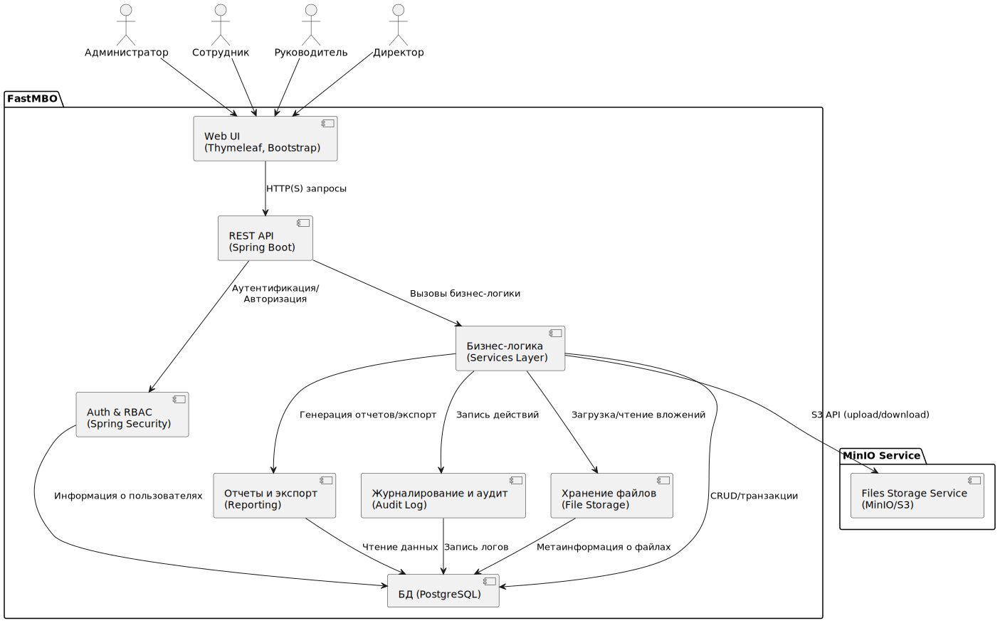
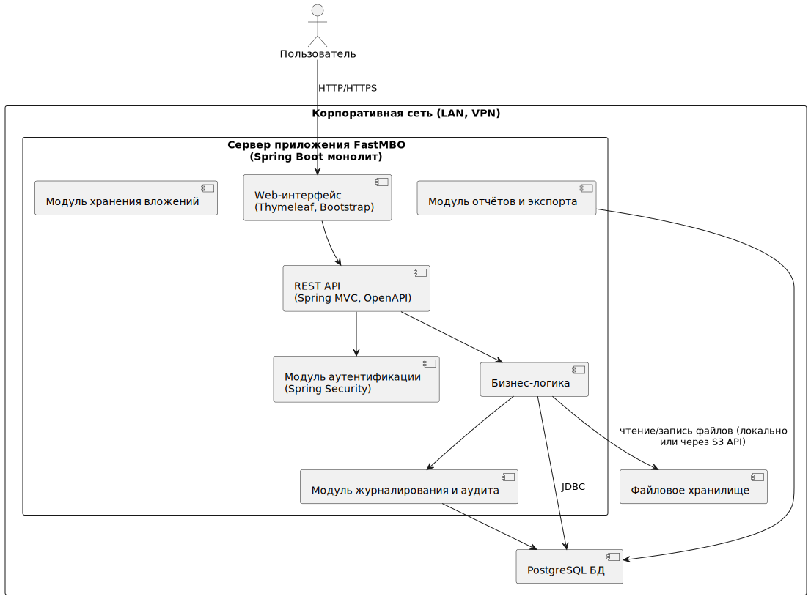

# Функциональные требования

## 1. Описание функциональных модулей

### 1.1 Отчетные периоды
1. Создание нового отчетного периода. Период виден только администрации;
2. Указание стимулирующего фонда для периода;
3. Запуск периода. Период становится видим всем сотрудникам;
4. Завершение периода с блокировкой изменений;
5. Архивация периода. Период пропадает у всех пользователей кроме администрации;
6. Экспорт периода (экспорт всех метрик, достижений, вложений и результатов);
7. Удаление периода с высвобождением занятого вложениями места.

### 1.2. Оценочные листы
1. Администрация может создавать, редактировать и удалять оценочные листы
2. Каждый оценочный лист содержит следующие поля:
   1. Название листа
   2. На какие должности распространяется лист
   3. В каких отчетных периодах действует
   4. Какие метрики содержит
   5. Экземпляры достижений каких типов можно добавлять сотруднику, имеющему должность с этим оц.листом
3. Редактировать оц.лист можно только тогда, когда он входит в период, который ещё не активен. Если активен или завершен, редактировать нельзя.
4. Администрация может дублировать оценочные листы, чтобы вносить изменения и прикреплять к новым периодам

### 1.3 Метрики
1. Добавление, редактирование и удаление метрик до запуска периода;
2. Каждая метрика содержит:
   1. название, описание;
   2. диапазон веса (min/max);
   3. период действия;
   4. группы сотрудников, к которым она применяется.
3. Метрики становятся неизменяемыми после начала периода.

### 1.4 Достижения
1. Администрация может создавать, редактировать и удалять типы достижений
2. Тип достижения абстрактен и содержит следующие поля:
   1. имя типа достижения (например, "Грамота федерального уровня");
   2. диапазон баллов (минимум и максимум);
   3. текстовое описание условий получения максимума или минимума баллов;
3. Сотрудник может добавлять экземпляр достижения, указав:
   1. тип достижения;
   2. обоснование (текст);
   3. прикреплённый файл (до 10 МБ);
   4. число баллов в пределах допустимого диапазона.
4. После добавления достижение получает статус "на валидации";
5. Руководитель видит достижения своих подчинённых;
6. Возможность подтвердить или отклонить каждое достижение;
7. Подтверждение переводит достижение в статус "подтверждено";
8. Отклонение — в статус "отклонено";
9. Комментарий при отклонении — опционален.

### 1.5 Расчёт премий
1. Расчёт запускается администратором после завершения периода.
2. Для каждого сотрудника рассчитывается:
   1. сумма баллов;
   2. доля от общего фонда;
   3. итоговая премия.
3. Баллы, фонд и результат фиксируются и становятся read-only.

### 1.6 Пользователи
1. У администратора системы должна быть возможность добавлять, редактировать и удалять пользователей системы
2. У учетной записи пользователя должны быть следующие обязательные поля:
   1. Имя
   2. Фамилия
   3. Отчество
   4. Логин в системе
   5. Пароль
   6. Должность
   7. Подразделение
   8. Дата рождения
   9. Комментарий
   10. Руководитель
   11. Временный руководитель
3. Привязка подчинённых к руководителям.
4. У администрации (директор и заместители) должна быть возможность выстраивать иерархию подчинения через заполнение у сотрудников поля Руководитель
5. Система должна предоставить возможность администрации (директору и заместителям) выстраивать временную иерархию подчинения через заполнение у сотрудников поля Временный руководитель
6. У заместителей директора, директора и администратора системы должна быть возможность создавать, редактировать и удалять должности

### 1.7 Журналирование действий
1. Все действия логируются:
   1. создание и редактирование метрик;
   2. добавление и изменение достижений;
   3. подтверждение и отклонение;
   4. завершение периода и расчёт премий.
2. Журнал доступен администраторам и заместителям.

### 1.8 Просмотр и экспорт данных
1. Доступ к информации ограничен ролью:
   1. сотрудник — свои достижения;
   2. руководитель — достижения подчинённых;
   3. заместитель и администратор — все данные.
2. Экспорт таблиц в Excel.
3. PDF экспорт — только клиентский (через браузер).

## 2. Ограничения и проверки
1. Достижение не может быть создано без файла.
2. Вес достижения должен попадать в min/max метрики.
3. Только руководитель может подтверждать достижения подчинённых.
4. Изменения недоступны после завершения периода.
5. Только директор может завершить период и инициировать расчёт.

## 4. Требования к интерфейсу

1. Максимум 2–3 клика до любой ключевой функции.
2. Термины должны быть однозначны: "метрика", "достижение", "период", "баллы", "премия".
3. Интерфейс адаптируется под малые экраны.

## 5. Архитектура

### 5.2. Компонентная диаграмма

### 5.3. Контейнерная диаграмма

## 6. Сценарии ошибок и исключений: 

Пользователь пытается добавить достижение вне открытого периода
— Ошибка: “В данный момент нельзя добавлять достижения. Нет открытого периода.”

Файл превышает максимальный размер или недопустимый тип
— Ошибка: “Файл должен быть не более 10 МБ и в формате PDF, JPG, PNG, DOCX.”

Вводимое число баллов вне допустимого диапазона метрики/достижения
— Ошибка: “Число баллов должно быть между {min} и {max}.”

Попытка редактировать метрику или достижение после блокировки
— Ошибка: “Редактирование недоступно. Метрика/достижение заблокировано после подтверждения или завершения периода.”

Попытка подтвердить достижение не руководителем
— Ошибка: “Только руководитель может подтверждать достижения подчинённых.”

Попытка завершить период при наличии неутверждённых метрик или достижений
— Ошибка: “Нельзя завершить период: не все достижения и метрики утверждены.”

Попытка удалить пользователя, к которому привязаны активные данные
— Ошибка: “Нельзя удалить пользователя: имеются связанные оценки или достижения.”

Попытка входа с неактивным или удалённым пользователем
— Ошибка: “Пользователь заблокирован или удалён.”

Ошибка валидации обязательных полей
— Ошибка: “Пожалуйста, заполните все обязательные поля.”

Внутренняя ошибка сервера, сбой загрузки файла, недоступность сервиса
— Ошибка: “Внутренняя ошибка системы. Попробуйте повторить позже или обратитесь к администратору.”